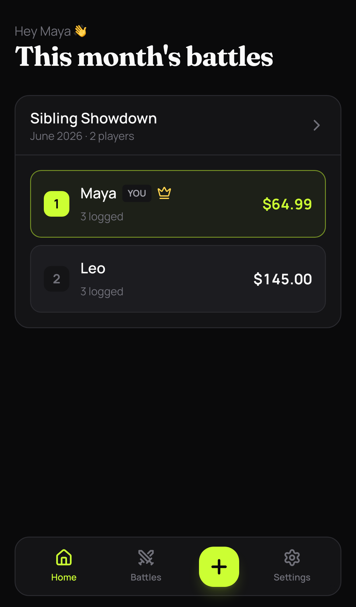
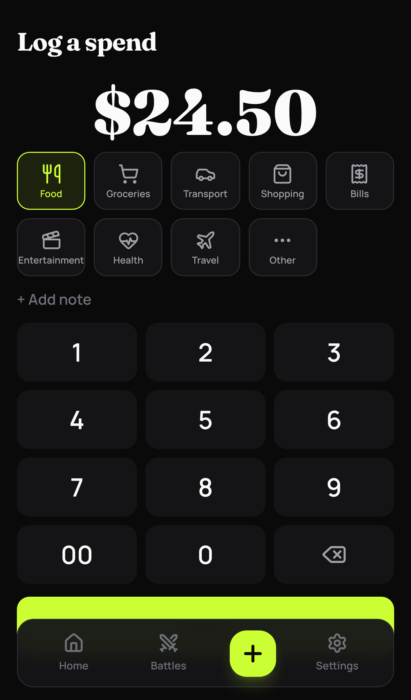
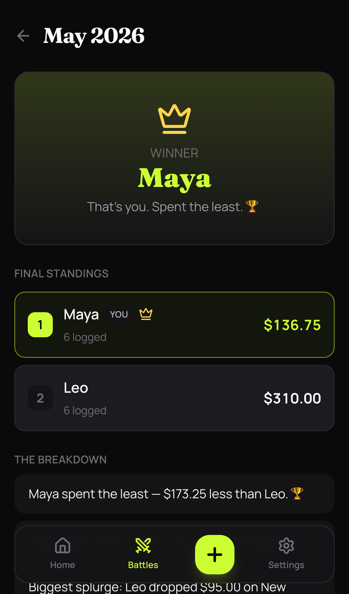

# Spendoff

> A competitive personal-spending tracker. Log in two taps, settle it monthly, lowest spender wins.

**Live:** [spendoff.us](https://spendoff.us) · **Writeup:** [hla.dev/builds/spendoff](https://hla.dev/builds/spendoff)


Spendoff is a PWA where you and your friends or family each log your own spending, fast. At the end of every month it's a head-to-head: the lowest spender wins, with a full breakdown by category, spending trends, and playful callouts. It's not bill-splitting. Spending is personal; the competition is the point.

<p align="center">
  
  
  
</p>

## Highlights

- **Offline-first logging.** A spend writes to an IndexedDB outbox first and syncs via Background Sync (with an `online`/on-mount replay fallback). Idempotency keys mean it never double-inserts, so logging never fails on a flaky connection.
- **Passwordless auth.** Passkeys (WebAuthn) with an email magic-link fallback for new devices.
- **A pure scoring engine.** Three win rules, ties, zero-log handling, per-category winners, trends, and callouts, all in one deterministic function. Two players render as a head-to-head; three-plus becomes a leaderboard.
- **Installable PWA.** Web app manifest, hand-rolled service worker, and web push.

## Stack

This repo is the **frontend**:

- [TanStack Start](https://tanstack.com/start) (React 19) on Cloudflare Workers
- Tailwind v4, TanStack Query, `motion`, shadcn primitives
- oxlint + Prettier, TypeScript

The **backend** (auth, the scoring engine, cron-driven month close, notifications) runs as a [Hono](https://hono.dev) + [chanfana](https://chanfana.com) module on Cloudflare Workers with **D1** (SQLite) and **KV**, deployed as part of a private shared backend. In production the browser only talks to `spendoff.us`: a custom server entry forwards `/api/v1/spendoff/*` to that backend over a Cloudflare **service binding**, so the API stays same-origin (first-party cookies, no CORS).

> The backend isn't included in this repo, so the app won't run end to end from a clean clone without one. The frontend code, offline queue, PWA, and UI are all here.

## Local development

```bash
bun install
bun run dev      # http://localhost:3000
```

In dev, `vite.config.ts` proxies `/api/v1/spendoff/*` to a local backend at `http://localhost:8787`.

## Scripts

```bash
bun run dev        # vite dev server
bun run build      # production build
bun run lint       # oxlint
bun run typecheck  # tsc --noEmit
bun run format     # prettier --write
bun run deploy     # build + wrangler deploy
```

## License

[MIT](LICENSE) © Hla Htun
